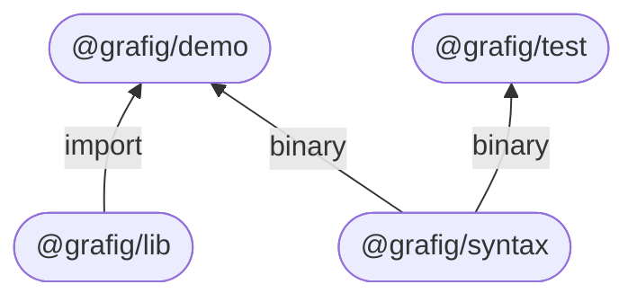
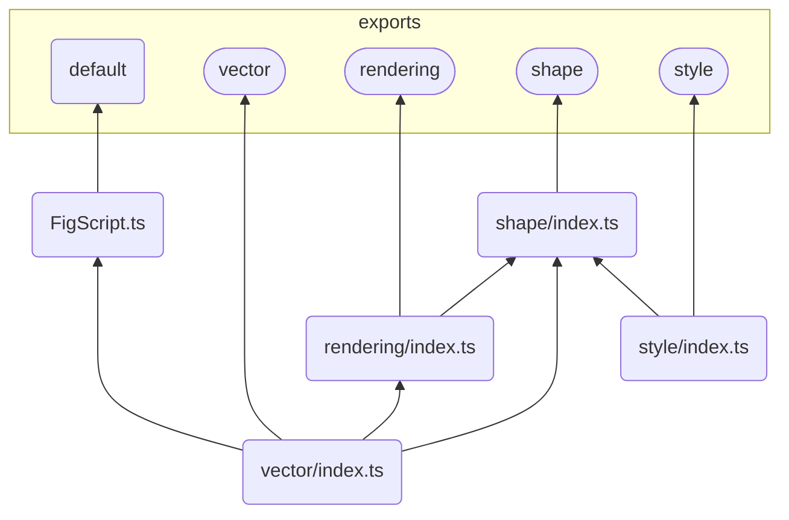

# Architecture

This project uses a monorepo architecture whereby the distinct compmonents of the application suite are held within a single, top-level package using [workspaces](https://classic.yarnpkg.com/lang/en/docs/workspaces/)[^1].

## Packages

The four packages of this project each follow the structure of a typical `npm` or `yarn` package, using a `package.json` to declare the entry point and package scripts.

### `@grafig/demo`

An example application that uses the developed framework. Contains a top-level `index.html` file that links to the two simple internal packages, `ulam` and `fenstring` each with their own `index.html` and `app.fs`. Each project is free to structure its internal logic seperately while also able to be bundled as a single application.

### `@grafig/lib`

The core functionality of the framework that handles vector mathematics, graphics rendering, etc. These functionalities are split into the following modules that each export their contents via an `index.ts` file within their directory:

| Module | Description |
| --- | --- |
| `rendering` | Exports core rendering functionality, such as drawing to the canvas context. |
| `vector` | Exports vector functionality, such as adding or multiplying vectors. |
| `shape` | Exports shape rendering functionality, such as drawing rectangles and text. |
| `style` | Exports styling functionality, such as fill color and line width. |
| *`FigScript`* | Exports functionality used within the extended syntax, such as operator overloading. This is used as the default export of the top-level package. |

### `@grafig/syntax`

Transpiler and complexity reporter program used to parse the [extended syntax](./figscript.md) using the [ANTLR parser generator tool](https://www.antlr.org). This package varys slightly from the average `npm` package in that, as it is predominantly a Golang project, it does not contain a `src` directory and instead replacing it with the following directories as outlined in the [Standard Go Project Structure](https://github.com/golang-standards/project-layout):

| Directory | Description |
| --- | --- |
| `bin` | Default destination for the compiled binary. |
| `cmd` | Contains the Cobra CLI for the binary. |
| `internal` | Contains the core application logic used by the CLI. |

The project uses dependency injection throughout, relying on concrete instances to fulfil the defined interfaces required by any functionality. The `internal` directory is then further broken down as follows:

| Directory | Description |
| --- | --- |
| `analyser` | Contains parse tree listeners used for complexity reporting. |
| `command` | Contains common utilities for Cobra commands. |
| `file` | Contains constants and filepath validation. |
| `logger` | Contains constants and trace logging. |
| `parser` | Contains ANTLR grammars and base parser instances. |
| `transpiler` | Contains parse tree listener used for transpilation. |
| `validation` | Contains parse tree listener used for validation. |

### `@grafig/test`

A package used for measuring the complexity of code written using various graphics libraries. Contains test files in the `src` directory that can be analysed, outputting a CSV file into `out`

[^1]: [ADR001 - Project Structure](./log/ADR001-project-structure.md)
